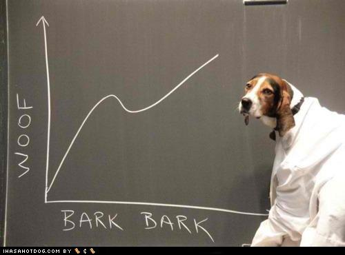

# Socioeconomic Pytrends project.

1. Introduction
2. How to use mentioned tools
3. Results
4. Analyzing results
5. Conclusion
6. Further improvements
7. Documentation

- https://datastudio.google.com/s/iV7dE0FHYSM 

------------------------------

# 1. Introduction.

Automated ETL involving the following tools:

- Cloud Scheduler: Schedule the Pub/Sub topic
- Pub/Sub: Triggers the Cloud Function
- Cloud Function: Python script requesting data from Google Trends and sending to Cloud Storage
- Cloud Storage: Data Lake
- BigQuery: Data Warehouse. Performs a weekly query modifying tables
- Data Studio: Dashboard of results 

Google Trends is a Google tool that analyses the popularity of top search queries in Google Search across various regions and languages. Basically, what people are looking for in Google.

Google trends searches the maximum on the specified period, makes that maximum the 100% of Trend Index and everything else is averaged by that top. If you request information weekly, you will have a point with 100% of Trend Index each week, regardless how popular it is.

- If you request a list of elements, all elements will be averaged by the top one.

- If you request each of your keywords separately, each keyword will be averaged on time by its own top.

------------------

# 2. How to use mentioned tools

### Create a new project and get your credentials here:

                https://console.cloud.google.com/projectselector2/iam-admin/serviceaccounts?_ga=2.187077160.1256540572.1587286598-806021438.1579453370&pli=1&supportedpurview=project

- Service Account: Give it a nice name
- Grant this service account access to the project: Just the required roles for Cloud Storage and Cloud Function.

### Create a bucket in Cloud Storage

                https://console.cloud.google.com/storage/create-bucket?
        
- Configure it: Due to our requirements we will use region location, but be careful, it can give you a hard headache, mainly if working with BigQuery or data from other regions that are not your selected one. Always locate all buckets where all data sources you are using for the same project. 

### Pytrends (keywords without accents or capital letters):

    - Videocalls: Zoom, Teams, Skype, Hangouts.
    - Messaging apps: WhatsApp, Telegram, Viber, Tiktok.
    - Politics: refugiados, inmigración, nacionalismo, corrupción, juicio, guerra comercial.
    - Health: coronavirus, pandemia, infeccion, médico.
    - Services: Amazon, Netflix, HBO, Rakuten, Steam, Cabify, taxi, Glovo, Just Eat, Deliveroo, Uber Eats.
    - Habits: Comida a domicilio, hacer deporte, yoga, meditación.
    - Improvement: Teletrabajo, videollamada, videoconferencia, cursos online.

- We have our reasons to not include keyword category within the code, in spite of it could be an accuracy improvement for keywords like "teams".

- We are intentionally requesting all information from the same start date while end date varies with time, we believe this is the most accurate way of requesting from Google Trends due to how Google process the asked data.

Why this folder has this structure can be found here:

        https://github.com/albertovpd/pytrends_cloud_function_example

### Deploy the scripts on Google Cloud Function:

1. Create a function here
        
                https://console.cloud.google.com/functions/add?
         
2. Trigger: Pub/sub
3. Give a name to your pub/sub topic
4. Runtime: Python 3.7
5. Stage bucket: The bucket you created in GCS
6. Advanced options, Region: Select the same region than the created bucket in GCS (this is very important) 

### Go to Cloud Scheduler to schedule your topic

                https://console.cloud.google.com/cloudscheduler/appengine

1. Select the same region than all before
2. Follow instructions and check your cronjob works :)

### Link Cloud Storage to Data Studio to have an automated dashboard of our keywords.

The result can be found here: (not yet)

### Bigquery:

1. Go there.
2. Create a dataset linking with GCS.
3. Find your GCS bucket.
4. Perform your querys

In this folder you will find the sql query, in case you want to take a glance.

### Data Studio:

Find your tables in BigQuery and make some art

---------------------------

# 3. Results

Results can be found here:

https://datastudio.google.com/s/iV7dE0FHYSM

-------------------------
# 4. Analyzing results

Do you remember when refugees or nationalism were main topic on TV in Spain? The topic will come back for other reasons like an economical crisis across Europe?  How long is going to be the keyword "economical war" the main topic of some politicians?

The circumstances we live right now are temporal or it will be part of our future? 

People will spend more money on non necessary purchases like ordering food from home?

Remote working will last after the crisis?
 
People will loose confidence in WhatsApp privacy? Tiktok will be part of our culture as a result of the lockdown?

At this date, wednesday 22.04.20, it is not easy to give an answer, nevertheless this dashboard would help us to understand the short term past, the present, and maybe the close future.

-----------------------
# 5. Conclusion 

Personally, this project has help me to reinforce my skills developing an ETL pipeline in Google Cloud environment.

I am exited to start the improvements, use Gdelt and Twitter APIs to generate a dashboard portraying the spanish social situation.

---------------------

# 6. Further improvements.

- Use the **deep sentiment analysis** of Gdelt Project to research the news media on Spain about further keywords ( https://www.gdeltproject.org ) with BigQuery  , but from the point of what people are looking for, not just what appears in the news.

Interesting themes to follow with Gdelt:

                WITH nested AS (
                SELECT SPLIT(RTRIM(Themes,';'),';') themes FROM `gdelt-bq.gdeltv2.gkg_partitioned` WHERE _PARTITIONTIME >= "2019-09-04 00:00:00" AND _PARTITIONTIME < "2019-09-05 00:00:00" and length(Themes) > 1
                ) select theme, count(1) cnt from nested, UNNEST(themes) as theme group by theme order by cnt desc

Candidate keywords:

- EPU_POLICY https://www.policyuncertainty.com/
- CRISISLEX_CRISISLEXREC https://blog.gdeltproject.org/crisislex-taxonomies-now-available-in-gkg/
- EPU_POLICY_GOVERNMENT
- MEDICAL
- ARMEDCONFLICT
- ARREST
- SCIENCE
- PROTEST	
- ECON_STOCKMARKET 
- TERROR
- MILITARY
- IDEOLOGY
- CORRUPTION
- WB_2837_IMMIGRATION
- TRANSPARENCY
- EXTREMISM
- REFUGEES
- WB_1235_CENTRAL_BANKS
- UNEMPLOYMENT
- REBELLION
- POLITICAL_TURMOIL
- SCANDAL
- ECON_INFLATION
- SURVEILLANCE

- Use other Python APis to track Stock Markets on time.

----------------------------

# 7. Documentation:

- What is Google Trends (no code)   https://www.karinakumykova.com/2019/03/calculate-search-interest-with-pytrends-api-and-python/

- List of categories: https://github.com/pat310/google-trends-api/wiki/Google-Trends-Categories

- Official documentation: https://pypi.org/project/pytrends/
- Info about how it works: https://www.karinakumykova.com/2019/03/calculate-search-interest-with-pytrends-api-and-python/
- The "real" Google Trends: https://towardsdatascience.com/google-trends-api-for-python-a84bc25db88f
- A great tutorial https://searchengineland.com/learn-how-to-chart-and-track-google-trends-in-data-studio-using-python-329119

--------------------------------

Project by César Castares and Alberto Vargas.

César:

        https://www.linkedin.com/in/cesar-castanon/

Alberto:

        https://www.linkedin.com/in/alberto-vargas-pina/

---------------------

